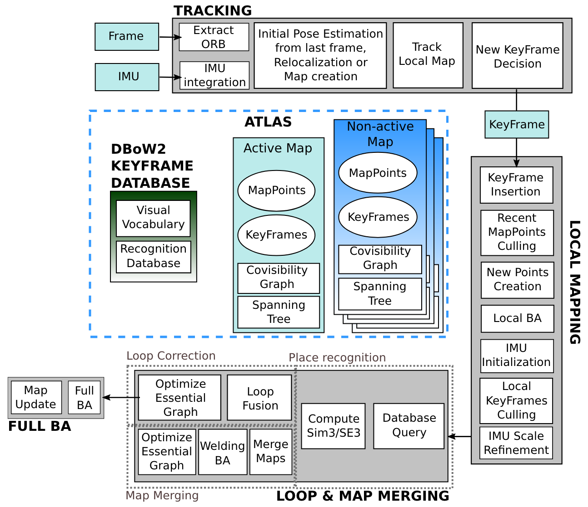

&emsp;
# Intro
- GitHub: https://github.com/UZ-SLAMLab/ORB_SLAM3
- Paper: https://arxiv.org/pdf/2007.11898.pdf

>Related Publications
- [`IMU-Initialization`] Carlos Campos, J. M. M. Montiel and Juan D. Tardós, Inertial-Only Optimization for Visual-Inertial Initialization, ICRA 2020. [PDF](https://arxiv.org/pdf/2003.05766.pdf)
- [`ORBSLAM-Atlas`] Richard Elvira, J. M. M. Montiel and Juan D. Tardós, ORBSLAM-Atlas: a robust and accurate multi-map system, IROS 2019. [PDF](https://arxiv.org/pdf/1908.11585.pdf).
- [`ORBSLAM-VI`] Raúl Mur-Artal, and Juan D. Tardós, Visual-inertial monocular SLAM with map reuse, IEEE Robotics and Automation Letters, vol. 2 no. 2, pp. 796-803, 2017. [PDF](https://arxiv.org/pdf/1610.05949.pdf).
- [`Stereo and RGB-D`] Raúl Mur-Artal and Juan D. Tardós. ORB-SLAM2: an Open-Source SLAM System for Monocular, Stereo and RGB-D Cameras. IEEE Transactions on Robotics, vol. 33, no. 5, pp. 1255-1262, 2017. [PDF](https://arxiv.org/pdf/1610.06475.pdf).
- [`Monocular`] Raúl Mur-Artal, José M. M. Montiel and Juan D. Tardós. ORB-SLAM: A Versatile and Accurate Monocular SLAM System. IEEE Transactions on Robotics, vol. 31, no. 5, pp. 1147-1163, 2015. (2015 IEEE Transactions on Robotics Best Paper Award). [PDF](https://arxiv.org/pdf/1502.00956.pdf).
- [`DBoW2 Place Recognition`] Dorian Gálvez-López and Juan D. Tardós. Bags of Binary Words for Fast Place Recognition in Image Sequences. IEEE Transactions on Robotics, vol. 28, no. 5, pp. 1188-1197, 2012. [PDF](http://doriangalvez.com/php/dl.php?dlp=GalvezTRO12.pdf)

&emsp;
>ORB-SLAM3 框架结构

    

