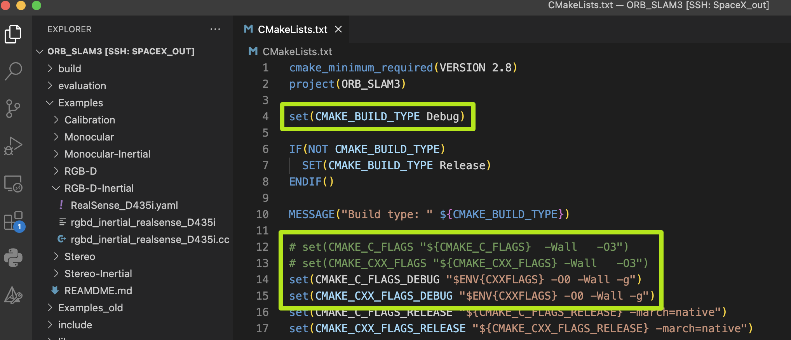

&emsp;
# Debug
- VSCode
- cmake

## 1 安装插件
在 VSCode 上安装
- C/C++
- C/C++ Extension Pack

&emsp;
## 2 重新编译


>修改 ORB_SLAM3/CMakeLists.txt
```cmake
set(CMAKE_BUILD_TYPE Debug)
set(CMAKE_C_FLAGS_DEBUG "$ENV{CXXFLAGS} -O0 -Wall -g")
set(CMAKE_CXX_FLAGS_DEBUG "$ENV{CXXFLAGS} -O0 -Wall -g")
```

<div align=center>
    
</div>


>重新编译
```sh
cd build
cmake .. -DCMAKE_BUILD_TYPE=Release \
-DOpenCV_DIR=/home/nerf/datav/SourceCode/opencv-4.5.1/build/ \
-Drealsense2_DIR=/home/nerf/datav/3rdParty/realsense-2.54.2/lib/cmake/realsense2
make -j$(nproc)
```


&emsp;
## 3 配置 JSON
最重要的就是 `tasks.json` 与 `launch.json`


>task.json
- 编译过程,用于在launch前执行编译任务
- Terminal - Configure Tasks - CMake: build
>launch.json
- launch.json：用来读取可执行文件, 启动编译好的二进制
- Run - Add Configurations...（要先打开需要debug的cpp文件）

>c_cpp_properties.json
- 主要是一些头文件路径的设置, 让 IDE 可以找到头文件

之后可能还会报一些错误, 已经不重要了, 无非就是一些头文件的路径暂时还没加进去, 可以开始 Debug, 后续再加


